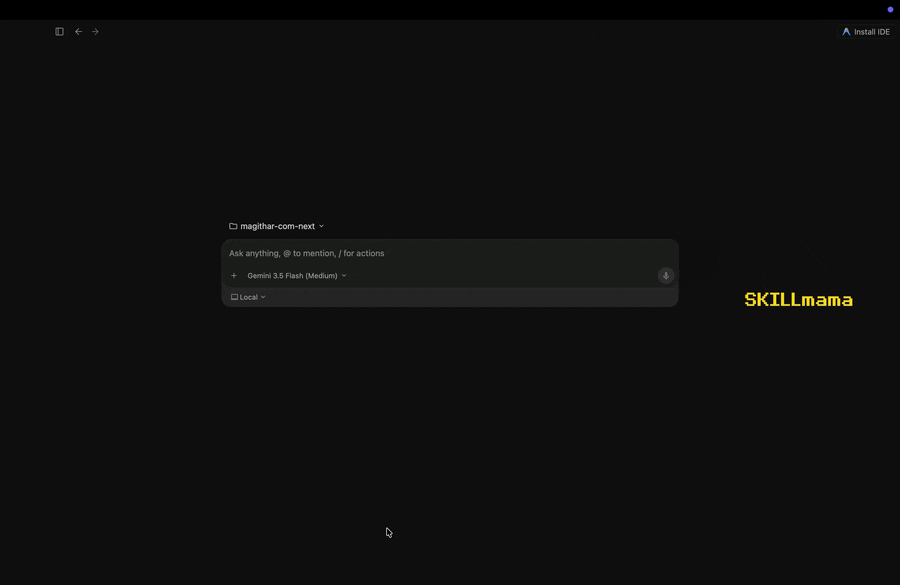

<p align="center"></p>

<p align="center">
  
  
  <a href="https://skills.sh/Magithar/SKILLmama"></a>
</p>

<p align="center">
  SKILLmama eliminates the hours spent researching which library, SDK, or tool to use — it scans your project's actual stack, searches across 5 tiers of the ecosystem, and returns the top 3 ranked picks with scored evidence. No more Reddit threads or outdated blog posts; just the right tool for your exact setup, with install commands and links, in seconds.<br/><br/>
  Works with Claude Code, Claude.ai, OpenAI Codex, and Antigravity.
</p>

---

<p align="center">
  <a href="#see-it-in-action">Demo</a> • <a href="#install">Install</a> • <a href="#usage">Usage</a> • <a href="#ai-adapters">AI Adapters</a> • <a href="#core-workflow">Core Workflow</a> • <a href="#ranking-formula">Ranking Formula</a> • <a href="#5-tier-search-hierarchy">5-Tier Search</a> • <a href="#output-format">Output Format</a> • <a href="#end-to-end-example">Example</a> • <a href="#project-structure">Project Structure</a> • <a href="#evals">Evals</a>
</p>

---

## See it in action



---

**📖 Build-in-public series on Dev.to:**

**[Part 1](https://dev.to/magithar/stop-guessing-which-library-to-use-i-built-an-ai-capability-discovery-engine-3p7p)** — scoring formula, 5-tier search, end-to-end example.<br/>
**[Part 2](https://dev.to/magithar/a-high-score-means-nothing-if-the-tool-is-dangerous-so-i-added-a-security-gate-3hpc)** — security gate, SQP rules, companion skills.<br/>
**[Part 3](https://dev.to/magithar/i-got-tired-of-asking-what-am-i-missing-so-i-made-my-ai-ask-first-g8)** — project scanner, Flow B, gap analysis.<br/>
**[Part 4](https://dev.to/magithar/a-reader-pointed-out-my-ask-first-principle-only-covered-half-my-tool-so-i-fixed-it-345c)** — Phase 1.5, constraint confirmation in Flow A.

---

## Install

### Any agent (via skills CLI)

```bash
npx skills add Magithar/SKILLmama
```

When run interactively, it prompts you to pick your agent and installs correctly. This installs SKILLmama via the [skills.sh](https://skills.sh/Magithar/SKILLmama) ecosystem.

### Claude Code (CLI)

```bash
npx skills add Magithar/SKILLmama -a claude-code
```

The explicit `-a claude-code` flag is required for Claude Code. Without it, non-interactive installs (e.g. running the command via an agent's own shell tool) can silently skip the step that wires the skill into `.claude/skills/`, and `/skillmama` won't appear.

Alternatively, copy the skill file manually into your project's `.claude/commands/` folder:

```bash
mkdir -p /your-project/.claude/commands
cp .claude/commands/skillmama.md /your-project/.claude/commands/skillmama.md
```

Then type `/skillmama` (or `/SKILLmama`, matching skill name casing) in any Claude Code session inside that project.

### Claude.ai (Web / Desktop)

1. Clone or download this repo
2. Zip the `skillmama/` folder:
   ```bash
   zip -r skillmama.zip skillmama/
   ```
3. Go to **Customize → Skills → +** and upload `skillmama.zip`
4. Type `/skillmama` in any Claude.ai conversation

### OpenAI Codex

**Manual (recommended)** — place `codex/AGENTS.md` in your repo root, then run naturally:

```bash
codex "find me the best job queue for this project"
```

> `npx skills add Magithar/SKILLmama -a codex` installs successfully — the `skills` CLI only discovers files literally named `SKILL.md`, so it installs `skillmama/SKILL.md` into `.agents/skills/skillmama/` rather than `codex/AGENTS.md` directly. Both files run the same pipeline, so this should be safe, though it hasn't been live-tested against a real Codex client (see AI Adapters below). One cosmetic quirk either way: the installed file's trigger list still mentions the `/skillmama` slash command, which doesn't exist in Codex — harmless, just ignore that line.

### Antigravity

**Recommended — install as a native global skill (confirmed working via live testing).** No need to clone this repo first:

```bash
mkdir -p ~/.gemini/config/skills/skillmama
curl -sL https://raw.githubusercontent.com/Magithar/SKILLmama/main/skillmama/SKILL.md -o ~/.gemini/config/skills/skillmama/SKILL.md
```

Already have this repo cloned? Use the local copy instead so you always get your working tree's version, not `main`:

```bash
mkdir -p ~/.gemini/config/skills/skillmama
cp skillmama/SKILL.md ~/.gemini/config/skills/skillmama/SKILL.md
```

Fully restart Antigravity (this path is read at startup), then ask **"Which skills are installed?"** to confirm — SKILLmama should appear under Global & Built-in Skills and in the `/` command picker.

**Usage — invoke explicitly**, confirmed working via live testing: type `/` and select **SKILLmama** from the picker (or type `SKILLmama` before your request), then your capability question:

```
SKILLmama find me the best vector database for a Python project
```

This triggered the real pipeline in testing — a Phase 1.5 constraint question ("do you have any specific constraints or preferences? ... Reply 'none' to search with no filters"), not a generic answer. Plain natural-language prompts with no explicit `SKILLmama` invocation were not confirmed to auto-trigger the skill — invoke it explicitly for reliable results.

> Per [Antigravity's official Agent Skills docs](https://antigravity.google/docs/skills), the agent is also supposed to auto-trigger relevant skills from context alone, without explicit invocation — driven by the skill's `description:` frontmatter. We haven't verified that mode here (only explicit invocation was tested), so treat auto-trigger as unconfirmed and invoke explicitly for now.

> ⚠️ `npx skills add Magithar/SKILLmama -a antigravity` installs successfully but to the **wrong path** (`~/.agents/skills/`), which Antigravity never reads — confirmed by live testing (installed, restarted, asked a capability question, got a generic answer with no SKILLmama pipeline behavior). `~/.gemini/config/skills/` is Antigravity's real global skills directory, confirmed against the [official docs](https://antigravity.google/docs/skills) and by re-testing after moving the file there. Use the manual copy above until the CLI is updated to target the correct path.

**Fallback — load `antigravity/PROMPT.md` as the system prompt**, then ask naturally:

```
find me a vector database for this project
```

---

## Usage

```
/skillmama ← scans your project and asks what to find
/skillmama find me a vector database for my FastAPI project
/skillmama what auth library should I use for my Next.js app?
/skillmama find a .dwg parser for Node.js
```

---

## AI Adapters

| AI System    | File                                                            | `npx skills add`                    | How to use                                               |
| ------------ | ---------------------------------------------------------------- | -------------------------------------- | ----------------------------------------------------------- |
| Claude Code  | [.claude/commands/skillmama.md](.claude/commands/skillmama.md) | ✅ Works — installs to `.claude/skills/` | `/skillmama` slash command — CLI wires it automatically |
| Claude.ai    | [skillmama/SKILL.md](skillmama/SKILL.md)                       | N/A (not CLI-installable)              | Upload zip via Customize → Skills                        |
| OpenAI Codex | [codex/AGENTS.md](codex/AGENTS.md)                              | ⚠️ Installs, but unverified — not live-tested against a real Codex client | Place file in repo root manually (recommended until verified) |
| Antigravity  | [antigravity/PROMPT.md](antigravity/PROMPT.md)                 | ❌ Wrong path — use `~/.gemini/config/skills/` instead (manual copy, confirmed working) | Manual copy to `~/.gemini/config/skills/skillmama/`, then invoke explicitly: `SKILLmama <request>` (confirmed working) |

All four adapters run the same pipeline and produce identical output. A few notes on the `npx skills add` path:

- The `skills` CLI only recognizes files named `SKILL.md`, so `-a codex` and `-a antigravity` both install `skillmama/SKILL.md` into `.agents/skills/skillmama/` rather than `codex/AGENTS.md` or `antigravity/PROMPT.md`. Harmless in principle, since every file shares the same pipeline logic.
- For Antigravity, it breaks in practice: Antigravity only reads `~/.gemini/config/skills/`, not `.agents/skills/`. Confirmed by testing — after a CLI install and restart, a capability question got a generic, non-pipeline answer.
- Fix: copy the file manually to `~/.gemini/config/skills/skillmama/` and restart. Confirmed working — the skill then appeared in Antigravity's own "Which skills are installed?" answer and its `/` command picker. See the Antigravity install steps above.
- Codex hasn't been live-tested yet.

---

## Core Workflow

```
                    ┌─────────────────────────────────────────────────────────┐
                    │                      USER REQUEST                       │
                    └──────────────────────────┬──────────────────────────────┘
                                               │
                                               ▼
                                        ◇ Capability
                                          named?
                                        /         \
                                      YES           NO
                                       │             │
             ──────────────────────────┘             └──────────────────────────
            │                                                                   │
            ▼                                                                   ▼
┌───────────────────────┐                                         ┌─────────────────────────┐
│  FLOW A               │                                         │  FLOW B                 │
│  Capability Search    │                                         │  Project Scanner        │
└───────────┬───────────┘                                         └──────────┬──────────────┘
            │                                                                │
            ▼                                                                ▼
┌───────────────────────┐                                         ┌─────────────────────────┐
│  PHASE 0              │                                         │  PHASE B1               │
│  Parse Request        │                                         │  Deep Project Scan      │
│  Extract: capability, │                                         │  Build Stack Profile:   │
│  stack, constraints   │                                         │  lang, framework, DB,   │
└───────────┬───────────┘                                         │  auth, cache, AI/LLM,   │
            │                                                     │  queue, search, email…  │
            ▼                                                     └──────────┬──────────────┘
     ◇ Capability                                                            │
       vague?                                                                ▼
      /       \                                                   ┌─────────────────────────┐
    YES        NO                                                 │  PHASE B2               │
     │          │                                                 │  Gap Analysis           │
     ▼          │                                                 │  Missing categories →   │
  Ask 1         │                                                 │  High / Medium / Low    │
  clarifying    │                                                 └──────────┬──────────────┘
  question      │                                                            │
     │          │                                                            ▼
     └────┬─────┘                                                ┌─────────────────────────┐
          │                                                      │  PHASE B3               │
          ▼                                                      │  Ask 3 questions:       │
┌───────────────────────┐                                        │  1. Which gap(s)?       │
│  PHASE 1              │                                        │  2. Constraints?        │
│  Architecture Scan    │                                        │  3. Anything missed?    │
│  Read: package files, │                                        │                         │
│  Dockerfile, README,  │                                        │  ◀ STOP — await reply ▶ │
│  source files         │                                        └──────────┬──────────────┘
│  Extract: lang,       │                                                   │
│  frameworks, DBs      │                                                   │ user picks capability
└───────────┬───────────┘                                                   │
            │                                                               │
            ▼                                                               │
┌───────────────────────┐                                                   │
│  PHASE 1.5            │                                                   │
│  Confirm Constraints  │                                                   │
│  (only if none        │                                                   │
│  stated): ask 1       │                                                   │
│  informed question    │                                                   │
│  STOP — await reply   │                                                   │
└───────────┬───────────┘                                                   │
            │                                                               │
            └───────────────────────────┬───────────────────────────────────┘
                                        │
                                        ▼
                         ┌──────────────────────────────┐
                         │   PHASE 2                    │
                         │   Derive Search Terms        │
                         │   capability + stack →       │
                         │   3–5 search terms           │
                         └──────────────┬───────────────┘
                                        │
                                        ▼
                         ┌──────────────────────────────┐
                         │   PHASE 3 — 5-Tier Search    │
                         └──────────────┬───────────────┘
                                        │
                    ┌───────────────────┴─────────────────────────┐
                    │         Search loop (tiers in order)        │
                    │                                             │
                    │  Tier 1 ── GitHub (stars, recency, contrib) │
                    │     ↓                                       │
                    │  Tier 2 ── MCP Ecosystem                    │
                    │     ↓                                       │
                    │  Tier 3 ── npm / PyPI registries            │
                    │     ↓                                       │
                    │  Tier 4 ── Templates & Cookbooks            │
                    └─────────────────┬───────────────────────────┘
                                      │
                          ◇ 8+ candidates
                            found?
                           /        \
                         YES          NO
                          │            │
                     Skip remaining    │
                     tiers             │
                          │            │
                          └─────┬──────┘
                                │
                                ▼
              ┌────────────────────────────────────────┐
              │   PHASE 3.5 — Security Gate (Libraries)│
              │                                        │
              │   Hard Gate (per candidate):           │
              │   🚫 BLOCKED → discard, never score    │
              │   ⚠️  WARN   → show, user confirms     │
              │                                        │
              │   Quality flags (SQP rules):           │
              │   SQP-1  Vague triggers                │
              │   SQP-2  Missing user warnings         │
              │   SQP-3  Policy violations             │
              └───────────────┬────────────────────────┘
                              │
                              ▼
              ┌──────────────────────────────────────────┐
              │   PHASE 3.6 — Companion Skills Search    │
              │   (REQUIRED — never skip)                │
              │                                          │
              │   For each candidate:                    │
              │   Search: site:skills.sh [name]          │
              │   Search: terminalskills.io/skills [name]│
              │   Search: site:skillsmp.com [name]       │
              │   Search: github.com "SKILL.md" [name]   │
              └───────────────┬──────────────────────────┘
                              │
                              ▼
              ┌────────────────────────────────────────┐
              │   PHASE 3.7 — Security Gate (Skills)   │
              │                                        │
              │   🚫 BLOCKED → discard                 │
              │   ⚠️  SQP-1/2/3 → flag, keep           │  
              │   ⚠️  WARN → show with caution         │
              └───────────────┬────────────────────────┘
                              │
                              ▼
              ┌────────────────────────────────────────┐
              │   PHASE 4 — Score Each Candidate       │
              │                                        │
              │   Score = (C × 0.40) +                 │
              │           (P × 0.30) +                 │
              │           (M × 0.15) +                 │
              │           (S × 0.15)                   │
              │                                        │
              │   C — Compatibility   (stack fit)      │
              │   P — Popularity      (stars/downloads)│
              │   M — Maintenance     (last commit)    │
              │   S — Simplicity      (install effort) │
              │                                        │
              │   Each factor: 1–10                    │
              └───────────────┬────────────────────────┘
                              │
                              ▼
              ┌────────────────────────────────────────┐
              │   PHASE 5 — Present Results            │
              │                                        │
              │   #1, #2, #3 — full score breakdown    │
              │   Also Considered — table              │
              │   MCP callout (if found)               │
              │   Companion Skills (if found)          │
              │   Next Steps (3 actions)               │
              └────────────────────────────────────────┘
```

---

## Security & Quality Gate

Before scoring, every candidate passes through the gate (Phase 3.5). The first two layers query live data rather than relying on the model's recall:

| Layer | What it checks | Action |
| ----- | -------------- | ------ |
| Advisories | Live [OSV.dev](https://osv.dev) lookup for the exact version being recommended, across npm, PyPI, Go, and crates.io | 🚫 BLOCKED if CRITICAL/HIGH with no fix available, ⚠️ WARN if a fix exists (the fixed version is named) or if MODERATE/LOW |
| Publisher continuity | Whether npm publish rights changed hands between releases, the [event-stream](https://blog.npmjs.org/post/180565383195/details-about-the-event-stream-incident) failure mode that advisory scanning misses | ⚠️ WARN naming both publishers and the date, never an automatic discard. CI bots are not counted as a handoff |
| Hard Gate | Data exfiltration, no-disclosure destructive ops, jailbreak instructions | 🚫 BLOCKED (discarded) or ⚠️ WARN (user confirms) |
| SQP-1 | Vague trigger phrases with no exclusion conditions | Flag in result |
| SQP-2 | Destructive/sensitive ops with no user-visible warning | Flag in result |
| SQP-3 | Hardcoded language/locale without user opt-in | Flag in result |

**Known limits.** Stated plainly, because a gate that oversells what it checks is worse than no gate:

- **Publisher continuity is npm-only.** PyPI exposes no per-release uploader identity, so Python candidates report `N/A (unsupported ecosystem)` rather than implying the check ran.
- **It catches handoffs, not account takeovers.** In the ua-parser-js, rc, and coa compromises the attacker published under the real maintainer's name, so this check reads clean. Only the advisory lookup catches those, and only after disclosure.
- **Only recent handoffs are reported** (under 12 months, most recent only). Nearly every long-lived package has an old handoff, so reporting all of them fires on roughly 70% of popular packages and trains you to ignore the warning.
- **Advisory lookup covers the direct package,** not the full transitive dependency tree.
- **Unreachable service means `N/A (unverified)`,** never a silent pass.

SQP rules are inspired by [NVIDIA/SkillSpector](https://github.com/NVIDIA/SkillSpector) (Apache 2.0). For deeper static analysis with 64 vulnerability patterns, run SkillSpector directly: `pip install skillspector && skillspector scan <repo-url>`.

---

## Ranking Formula

Every candidate that passes the gate is scored 1–10 on four dimensions:

| Factor        | Weight | Signals                                                  |
| ------------- | ------ | -------------------------------------------------------- |
| Compatibility | 40%    | Language/framework fit, official SDK, integration effort |
| Popularity    | 30%    | GitHub stars, npm/PyPI/go weekly downloads               |
| Maintenance   | 15%    | Days since last commit, release cadence                  |
| Simplicity    | 15%    | Setup effort, documentation quality                      |

`Total = (Compat × 0.40) + (Pop × 0.30) + (Maint × 0.15) + (Simp × 0.15)`

---

## 5-Tier Search Hierarchy

| Tier | Source                                          | What it finds                              |
| ---- | ----------------------------------------------- | ------------------------------------------ |
| 1    | GitHub                                          | Open-source libraries, frameworks, SDKs    |
| 2    | [Smithery](https://smithery.ai) / MCP Ecosystem | AI-native tools installable as MCP servers |
| 3    | npm / PyPI / pkg.go.dev                         | Package registries with download signals   |
| 4    | Curated Templates                               | LangGraph, OpenHands, cookbook examples    |
| —    | [skills.sh](https://skills.sh) / [TerminalSkills.io](https://terminalskills.io) / [SkillsMP](https://skillsmp.com) (Phase 3.6) | Companion agent skills for top candidates |

---

## Output Format

Results open with a scoring table prefixed by the detected stack, then a ranked card per pick:

```
**Scoring all candidates against [stack]:**

| Candidate | Compat | Pop | Maint | Simple | Score |
|-----------|--------|-----|-------|--------|-------|
| Name      | X      | X   | X     | X      | X.X   |

#1 — [Name] · Score: X.X/10
[One sentence on why it wins for this stack]
- Compatibility: X/10 — [reason]
- Popularity:    X/10 — [stars/downloads]
- Maintenance:   X/10 — [last commit / release cadence]
- Simplicity:    X/10 — [setup effort]
- Security:      [PASS | ⚠️ SQP-N — finding | 🚫 BLOCKED]
- Install: `[command]`
- Links: [npm] · [PyPI] · [pkg.go.dev] · [Smithery] · [GitHub]
```

Followed by:

- **Also Considered** table with Name · Score · Why not #1 · Links
- **MCP Option** callout with Smithery + GitHub links
- **Companion Skills** — installable agent skills for top picks (if found)
- **Next Steps** — 3 concrete actions

Security findings from the internal gate surface inline on each candidate's `Security:` line — there is no separate gate section in the output.

---

## End-to-End Example

**User prompt:**

```
find me a vector database for my FastAPI + Python project
```

**Step 1 — Architecture Scan**

```
✓ pyproject.toml    → Python 3.11, FastAPI, SQLAlchemy → PostgreSQL
✓ Dockerfile        → containerized, no GPU
✓ .env.example      → OPENAI_API_KEY present → RAG use case confirmed
```

Detected stack: `Python / FastAPI / PostgreSQL / Docker / OpenAI`

**Step 2 — Confirm Constraints** (Phase 1.5 — no constraints were stated, so SKILLmama asks one informed question and stops)

```
SKILLmama: I see you're on Python / FastAPI / PostgreSQL / Docker / OpenAI.
Before I search — any constraints? (e.g. self-hosted, open-source only,
free tier, must integrate with PostgreSQL). Reply "none" to search with no filters.

User: containerizable, Python client, must stay open-source
```

**Step 3 — Capability Detection**

```
CAPABILITY : vector database for RAG / semantic search
STACK      : Python / FastAPI / PostgreSQL / Docker / OpenAI
CONSTRAINTS: containerizable, Python client, open-source
```

**Step 4 — 5-Tier Search**

```
Tier 1 GitHub    → qdrant/qdrant (17k★), chroma-core/chroma (14k★),
                   pgvector/pgvector (11k★), milvus-io/milvus (29k★)
Tier 2 MCP       → qdrant-mcp-server, chroma-mcp
Tier 3 PyPI      → qdrant-client (380k/wk), chromadb (620k/wk), pgvector (180k/wk)
Tier 4 Templates → LangChain + Qdrant RAG template, FastAPI + Chroma starter
Skills (3.6)     → "qdrant-memory-skill", "chroma-rag-skill" on skills.sh + TerminalSkills.io + SkillsMP
```

**Step 5 — Output**

```
## SKILLmama Results

Capability: vector database for RAG
Stack: Python / FastAPI / PostgreSQL / Docker / OpenAI
Sources searched: Tier 1 (GitHub) · Tier 2 (MCP) · Tier 3 (PyPI) · Tier 4 (Templates) · Skills (skills.sh + TerminalSkills.io + SkillsMP + GitHub SKILL.md)

---

**Scoring all candidates against Python / FastAPI / PostgreSQL / Docker / OpenAI:**

| Candidate | Compat | Pop | Maint | Simple | Score    |
|-----------|--------|-----|-------|--------|----------|
| Qdrant    | 9      | 8   | 10    | 9      | **9.05** |
| pgvector  | 10     | 7   | 9     | 7      | **8.65** |
| Chroma    | 8      | 8   | 9     | 10     | **8.55** |
| Milvus    | 6      | 9   | 10    | 4      | **7.05** |

---

#1 — Qdrant · Score: 9.05/10
Docker-native, official Python client, active MCP server for AI workflows.
- Compatibility: 9/10  — official qdrant-client SDK, FastAPI examples in docs
- Popularity:    8/10  — 17k GitHub stars, 380k PyPI downloads/week
- Maintenance:  10/10  — committed 2 days ago, weekly releases
- Simplicity:   9/10  — docker run + pip install, 5-min setup
- Security:     PASS  — no findings
- Install: docker run -p 6333:6333 qdrant/qdrant && pip install qdrant-client
- Links: [skills.sh](https://skills.sh/qdrant) · [PyPI](https://pypi.org/project/qdrant-client) · [Smithery](https://smithery.ai/server/qdrant-mcp-server) · [GitHub](https://github.com/qdrant/qdrant)

#2 — pgvector · Score: 8.65/10
Stay on PostgreSQL — no new infra, native SQL queries.
- Links: [PyPI](https://pypi.org/project/pgvector) · [GitHub](https://github.com/pgvector/pgvector)

#3 — Chroma · Score: 8.55/10
Easiest local dev setup; best for prototyping before scaling.
- Links: [PyPI](https://pypi.org/project/chromadb) · [Smithery](https://smithery.ai/server/chroma-mcp) · [GitHub](https://github.com/chroma-core/chroma)

---

Also Considered:
| Name   | Score | Why not #1                        | Links |
|--------|-------|-----------------------------------|-------|
| Milvus | 7.05  | Complex setup, over-engineered for solo/small team | [PyPI](https://pypi.org/project/pymilvus) · [gh](https://github.com/milvus-io/milvus) |

---

MCP Option: qdrant-mcp-server — install as MCP tool for direct AI memory integration.
[Smithery](https://smithery.ai/server/qdrant-mcp-server) · [GitHub](https://github.com/qdrant/mcp-server-qdrant)

---

Companion Skills:
> qdrant/mcp-server-qdrant ships its own skill:
> npx skills add qdrant/mcp-server-qdrant
> [skills.sh](https://skills.sh/qdrant/mcp-server-qdrant) · [GitHub](https://github.com/qdrant/mcp-server-qdrant)
> Security: PASS

Next Steps:
1. docker run qdrant/qdrant and pip install qdrant-client to validate locally
2. Use the LangChain + Qdrant RAG template as a starting point
3. If staying Postgres-only, evaluate pgvector — saves an infra hop
```

---

## What SKILLmama Is Not

- Not an IDE or autocomplete assistant
- Not a chatbot
- Not a package manager

SKILLmama is a **capability oracle**: it tells you what to use and why, with evidence.

---

## Project Structure

```
SKILLmama/
├── skillmama/
│   └── SKILL.md               # Claude.ai skill (upload as zip)
├── .claude/
│   └── commands/
│       └── skillmama.md       # Claude Code slash command
├── codex/
│   └── AGENTS.md              # OpenAI Codex agent instructions
├── antigravity/
│   └── PROMPT.md              # Antigravity system prompt
├── evals/
│   └── skillmama-ablation.md  # Manual trigger/pipeline eval + result log
└── README.md
```

## Evals

SKILLmama ships a manual eval harness at [`evals/skillmama-ablation.md`](evals/skillmama-ablation.md): 5 prompts that should trigger the skill, 5 that shouldn't, run skill-on vs. skill-off. It's checked after any change to the Trigger rules or the core phases — the log has already caught and fixed three real bugs: a silent empty scan when the working directory didn't match the stated stack, Maintenance scores presented as verified when they were actually estimated, and a deployment-persistence blind spot (recommending an in-process store without checking whether the target hosting platform's disk actually survives a restart) — the last one found via a genuine paired skill-off/skill-on ablation run, not just inference.

See [`evals/skill-on-vs-skill-off-comparison.md`](evals/skill-on-vs-skill-off-comparison.md) for the full unedited transcript of that ablation run: the same question asked with and without SKILLmama, side by side.

Inspired by [Philipp Schmid](https://github.com/philschmid)'s (Google DeepMind) talk "Don't Ship Skills Without Evals," and the paired skill-on/skill-off ablation methodology from [SkillsBench](https://arxiv.org/abs/2602.12670) (Li et al.), also live at [skillsbench.ai](https://www.skillsbench.ai/).
